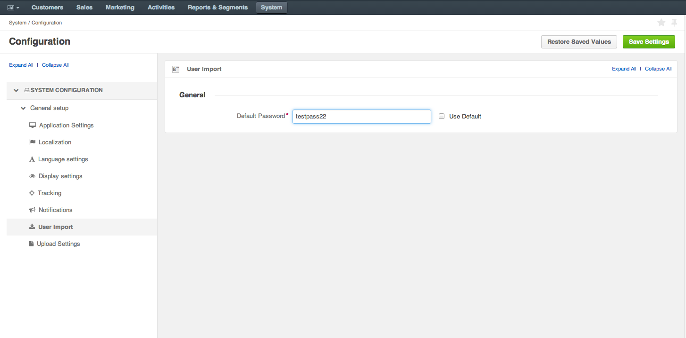
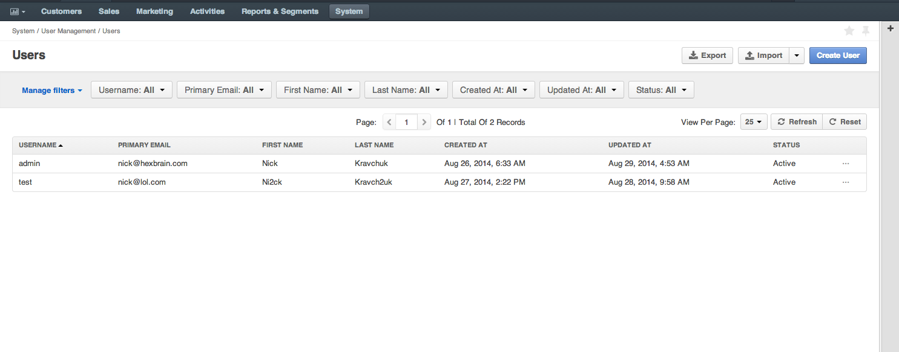
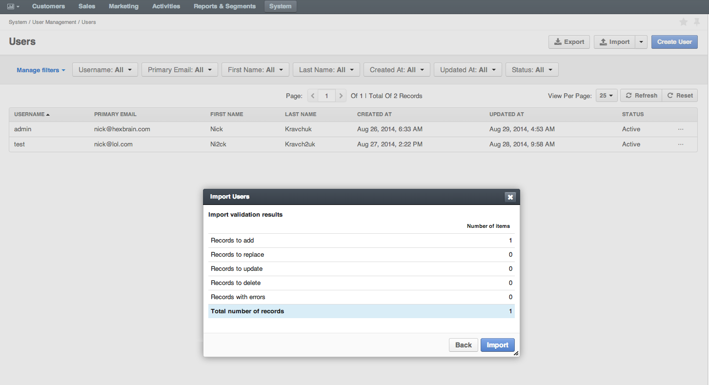

OroCRM User Import
========================

This bundle adds user import feature to OroCRM which allows import user from CSV files.

HexBrain is working on improvements for this bundle, if you find a bug or error.

Requirements
------------

User Import bundle supports OroCRM version 1.1 or above.

Instructions
------------
You need to set the default password under `System -> Configuration -> User Import`, only this feature is available for now, we will add sending pass to email ability in future
#### Screenshots





Installation
------------

#### Marketplace

Follow `System > Package Manager` to install it from [OroCRM Marketplace][1]

#### Composer

Add as dependency in composer
```bash
composer require hexbrain/hexbrain/orocrm-userimport-bundle:dev-master
```

In addition you will need to run platform update
```bash
php app/console oro:platform:update
```

[1]: http://www.orocrm.com/marketplace/oro-crm/package/orocrm-userimport-bundle